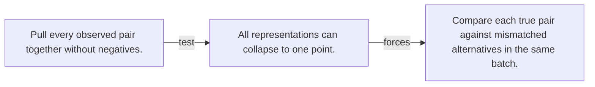

# Diagram — Excavation 092 — Contrastive Learning

The picture carries this excavation's particular counterexample and repair.



```text
TRY     Pull every observed pair together without negatives.
BREAK   All representations can collapse to one point.
REPAIR  Compare each true pair against mismatched alternatives in the same batch.
```
