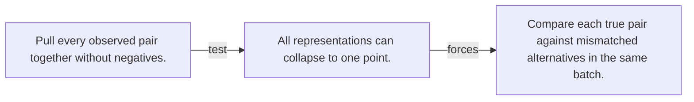

# Diagram — Excavation 092 — Contrastive Learning

The picture carries this excavation's particular counterexample and repair.



```text
TRY     Pull every observed pair together without negatives.
BREAK   All representations can collapse to one point.
REPAIR  Compare each true pair against mismatched alternatives in the same batch.
```

<!-- memory-film-v1:start -->
## Five-frame memory film

```text
QUESTION       What fails if we pull every observed pair together without negatives?
     ↓
OBJECT         the contrastive learning map mounted on the map of branching journeys
     ↓
VISIBLE BREAK  The map follows the tempting path—pull every observed pair together without negatives. Then the evidence answers: the trouble appears immediately: all representations can collapse to one point.
     ↓
TRANSFORMATION The expedition leader changes one moving part. The map can now compare each true pair against mismatched alternatives in the same batch.
     ↓
MEMORY SEAL    Contrastive Learning keeps the missing power: compare each true pair against mismatched alternatives in the same batch.
```
<!-- memory-film-v1:end -->
