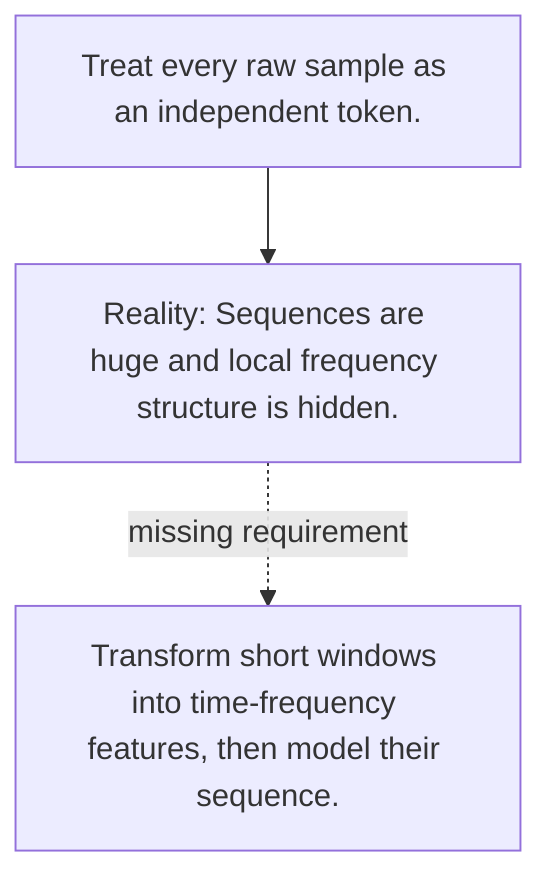

# Diagram — Excavation 093 — Speech and Audio

The picture carries this excavation's particular counterexample and repair.



```text
TRY     Treat every raw sample as an independent token.
BREAK   Sequences are huge and local frequency structure is hidden.
REPAIR  Transform short windows into time-frequency features, then model their sequence.
```

<!-- memory-film-v1:start -->
## Five-frame memory film

```text
QUESTION       What fails if we treat every raw sample as an independent token?
     ↓
OBJECT         the speech and audio scale mounted on the map of branching journeys
     ↓
VISIBLE BREAK  The scale follows the tempting path—treat every raw sample as an independent token. Then the evidence answers: sequences are huge and local frequency structure is hidden.
     ↓
TRANSFORMATION The expedition leader changes one moving part. The scale can now transform short windows into time-frequency features, then model their sequence.
     ↓
MEMORY SEAL    Speech and Audio keeps the missing power: transform short windows into time-frequency features, then model their sequence.
```
<!-- memory-film-v1:end -->
