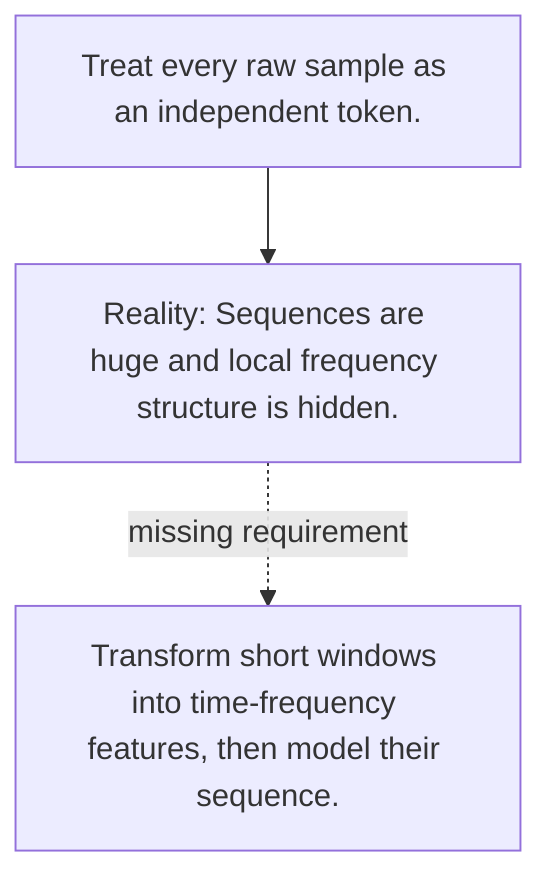

# Diagram — Excavation 093 — Speech and Audio

The picture carries this excavation's particular counterexample and repair.



```text
TRY     Treat every raw sample as an independent token.
BREAK   Sequences are huge and local frequency structure is hidden.
REPAIR  Transform short windows into time-frequency features, then model their sequence.
```
