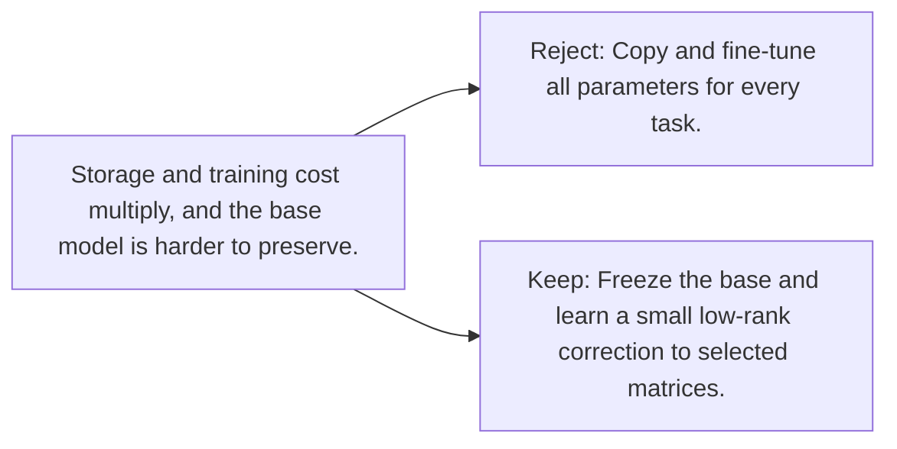

# Diagram — Excavation 094 — Low-Rank Adaptation

The picture carries this excavation's particular counterexample and repair.



```text
TRY     Copy and fine-tune all parameters for every task.
BREAK   Storage and training cost multiply, and the base model is harder to preserve.
REPAIR  Freeze the base and learn a small low-rank correction to selected matrices.
```

<!-- memory-film-v1:start -->
## Five-frame memory film

```text
QUESTION       What fails if we copy and fine-tune all parameters for every task?
     ↓
OBJECT         the low-rank adaptation gear mounted on the map of branching journeys
     ↓
VISIBLE BREAK  The gear follows the tempting path—copy and fine-tune all parameters for every task. Then the evidence answers: storage and training cost multiply, and the base model is harder to preserve.
     ↓
TRANSFORMATION The expedition leader changes one moving part. The gear can now freeze the base and learn a small low-rank correction to selected matrices.
     ↓
MEMORY SEAL    Low-Rank Adaptation keeps the missing power: freeze the base and learn a small low-rank correction to selected matrices.
```
<!-- memory-film-v1:end -->
