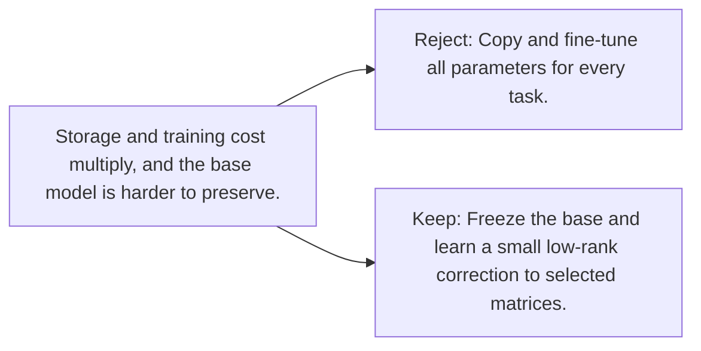

# Diagram — Excavation 094 — Low-Rank Adaptation

The picture carries this excavation's particular counterexample and repair.



```text
TRY     Copy and fine-tune all parameters for every task.
BREAK   Storage and training cost multiply, and the base model is harder to preserve.
REPAIR  Freeze the base and learn a small low-rank correction to selected matrices.
```
