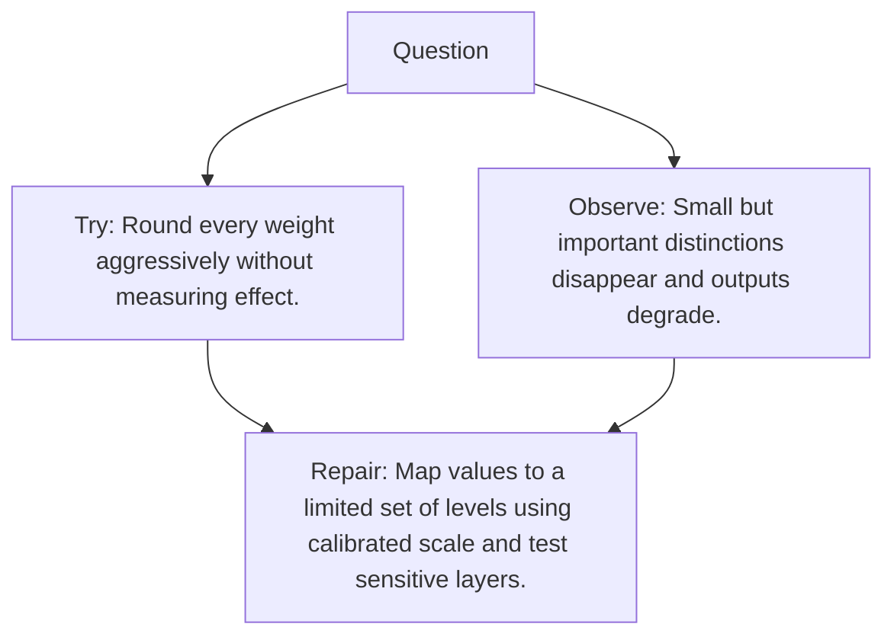

# Diagram — Excavation 095 — Quantization

The picture carries this excavation's particular counterexample and repair.



```text
TRY     Round every weight aggressively without measuring effect.
BREAK   Small but important distinctions disappear and outputs degrade.
REPAIR  Map values to a limited set of levels using calibrated scale and test sensitive layers.
```

<!-- memory-film-v1:start -->
## Five-frame memory film

```text
QUESTION       What fails if we round every weight aggressively without measuring effect?
     ↓
OBJECT         the quantization prism mounted on the map of branching journeys
     ↓
VISIBLE BREAK  The prism follows the tempting path—round every weight aggressively without measuring effect. Then the evidence answers: small but important distinctions disappear and outputs degrade.
     ↓
TRANSFORMATION The expedition leader changes one moving part. The prism can now map values to a limited set of levels using calibrated scale and test sensitive layers.
     ↓
MEMORY SEAL    Quantization keeps the missing power: map values to a limited set of levels using calibrated scale and test sensitive layers.
```
<!-- memory-film-v1:end -->
