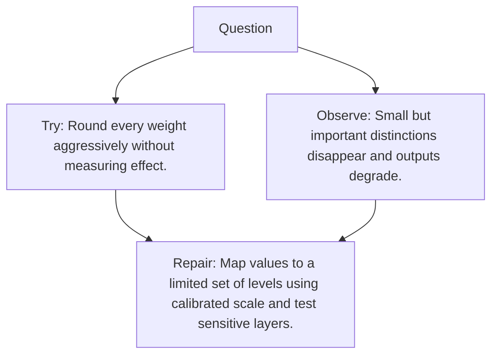

# Diagram — Excavation 095 — Quantization

The picture carries this excavation's particular counterexample and repair.



```text
TRY     Round every weight aggressively without measuring effect.
BREAK   Small but important distinctions disappear and outputs degrade.
REPAIR  Map values to a limited set of levels using calibrated scale and test sensitive layers.
```
