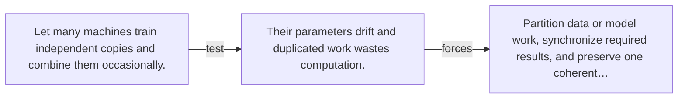

# Diagram — Excavation 096 — Distributed Training

The picture carries this excavation's particular counterexample and repair.



```text
TRY     Let many machines train independent copies and combine them occasionally.
BREAK   Their parameters drift and duplicated work wastes computation.
REPAIR  Partition data or model work, synchronize required results, and preserve one coherent…
```
