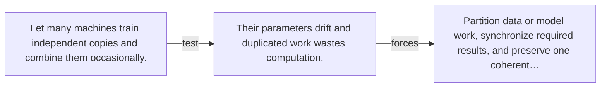

# Diagram — Excavation 096 — Distributed Training

The picture carries this excavation's particular counterexample and repair.



```text
TRY     Let many machines train independent copies and combine them occasionally.
BREAK   Their parameters drift and duplicated work wastes computation.
REPAIR  Partition data or model work, synchronize required results, and preserve one coherent…
```

<!-- memory-film-v1:start -->
## Five-frame memory film

```text
QUESTION       What fails if we let many machines train independent copies and combine them occasionally?
     ↓
OBJECT         the distributed training seal mounted on the map of branching journeys
     ↓
VISIBLE BREAK  The seal follows the tempting path—let many machines train independent copies and combine them occasionally. Then the evidence answers: their parameters drift and duplicated work wastes computation.
     ↓
TRANSFORMATION The expedition leader changes one moving part. The seal can now partition data or model work, synchronize required results, and preserve one coherent update.
     ↓
MEMORY SEAL    Distributed Training keeps the missing power: partition data or model work, synchronize required results, and preserve one coherent update.
```
<!-- memory-film-v1:end -->
