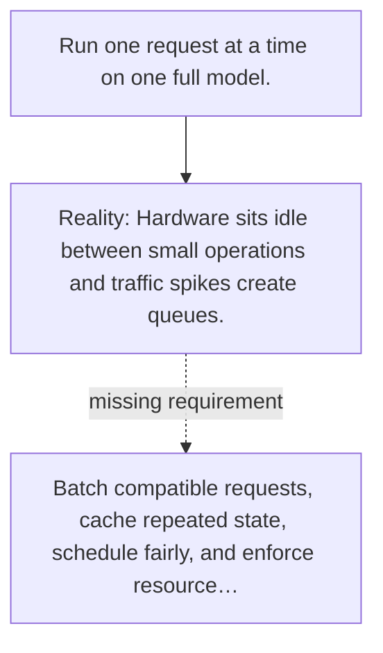

# Diagram — Excavation 097 — Inference Serving

The picture carries this excavation's particular counterexample and repair.



```text
TRY     Run one request at a time on one full model.
BREAK   Hardware sits idle between small operations and traffic spikes create queues.
REPAIR  Batch compatible requests, cache repeated state, schedule fairly, and enforce resource…
```
