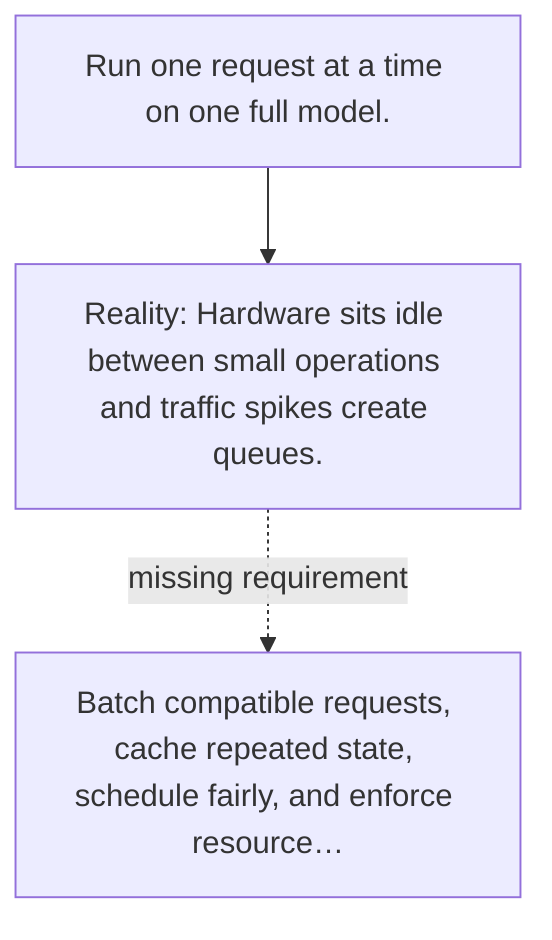

# Diagram — Excavation 097 — Inference Serving

The picture carries this excavation's particular counterexample and repair.



```text
TRY     Run one request at a time on one full model.
BREAK   Hardware sits idle between small operations and traffic spikes create queues.
REPAIR  Batch compatible requests, cache repeated state, schedule fairly, and enforce resource…
```

<!-- memory-film-v1:start -->
## Five-frame memory film

```text
QUESTION       What fails if we run one request at a time on one full model?
     ↓
OBJECT         the inference serving lens mounted on the map of branching journeys
     ↓
VISIBLE BREAK  The lens follows the tempting path—run one request at a time on one full model. Then the evidence answers: the trouble appears immediately: hardware sits idle between small operations and traffic spikes create queues.
     ↓
TRANSFORMATION The expedition leader changes one moving part. The lens can now batch compatible requests, cache repeated state, schedule fairly, and enforce resource limits.
     ↓
MEMORY SEAL    Inference Serving keeps the missing power: batch compatible requests, cache repeated state, schedule fairly, and enforce resource limits.
```
<!-- memory-film-v1:end -->
