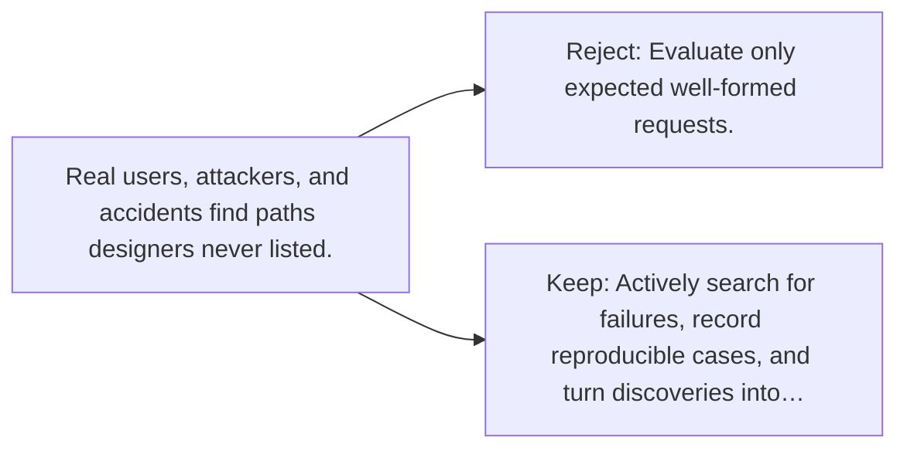

# Diagram — Excavation 098 — Red Teaming

The picture carries this excavation's particular counterexample and repair.



```text
TRY     Evaluate only expected well-formed requests.
BREAK   Real users, attackers, and accidents find paths designers never listed.
REPAIR  Actively search for failures, record reproducible cases, and turn discoveries into…
```
