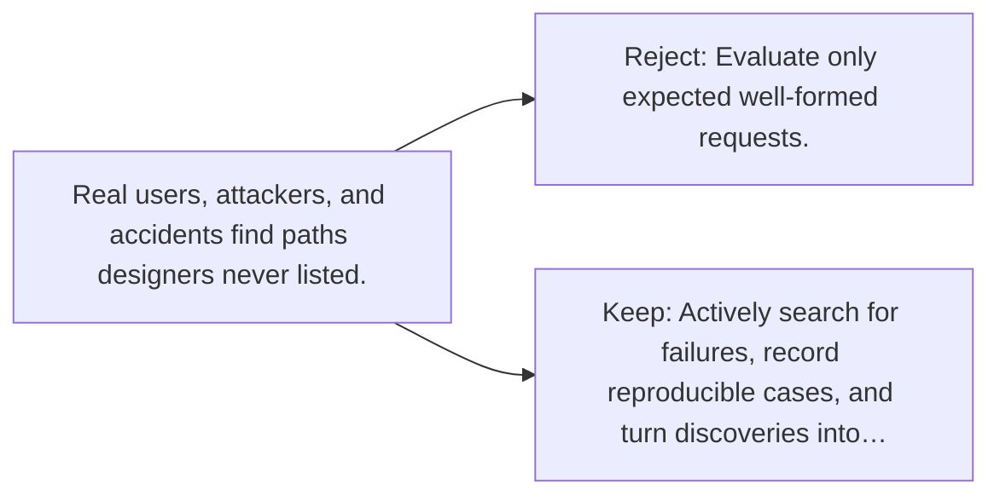

# Diagram — Excavation 098 — Red Teaming

The picture carries this excavation's particular counterexample and repair.



```text
TRY     Evaluate only expected well-formed requests.
BREAK   Real users, attackers, and accidents find paths designers never listed.
REPAIR  Actively search for failures, record reproducible cases, and turn discoveries into…
```

<!-- memory-film-v1:start -->
## Five-frame memory film

```text
QUESTION       What fails if we evaluate only expected well-formed requests?
     ↓
OBJECT         the red teaming key mounted on the map of branching journeys
     ↓
VISIBLE BREAK  The key follows the tempting path—evaluate only expected well-formed requests. Then the evidence answers: real users, attackers, and accidents find paths designers never listed.
     ↓
TRANSFORMATION The expedition leader changes one moving part. The key can now actively search for failures, record reproducible cases, and turn discoveries into regression tests and mitigations.
     ↓
MEMORY SEAL    Red Teaming keeps the missing power: actively search for failures, record reproducible cases, and turn discoveries into regression tests and mitigations.
```
<!-- memory-film-v1:end -->
