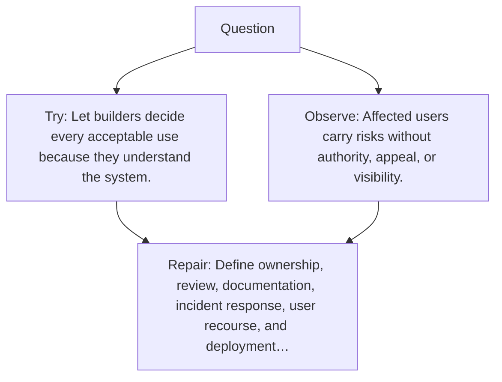

# Diagram — Excavation 099 — Governance — Who Decides and Who Is Accountable?

The picture carries this excavation's particular counterexample and repair.



```text
TRY     Let builders decide every acceptable use because they understand the system.
BREAK   Affected users carry risks without authority, appeal, or visibility.
REPAIR  Define ownership, review, documentation, incident response, user recourse, and deployment…
```
