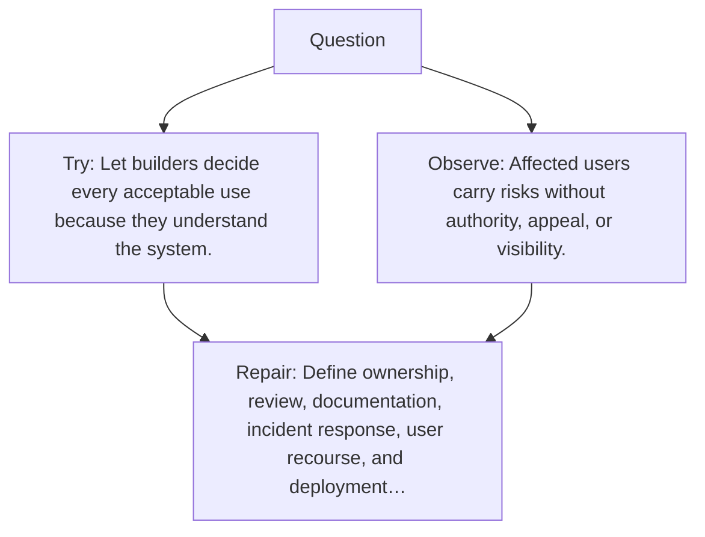

# Diagram — Excavation 099 — Governance — Who Decides and Who Is Accountable?

The picture carries this excavation's particular counterexample and repair.



```text
TRY     Let builders decide every acceptable use because they understand the system.
BREAK   Affected users carry risks without authority, appeal, or visibility.
REPAIR  Define ownership, review, documentation, incident response, user recourse, and deployment…
```

<!-- memory-film-v1:start -->
## Five-frame memory film

```text
QUESTION       Who Decides and Who Is Accountable?
     ↓
OBJECT         the governance lantern mounted on the map of branching journeys
     ↓
VISIBLE BREAK  The lantern follows the tempting path—let builders decide every acceptable use because they understand the system. Then the evidence answers: affected users carry risks without authority, appeal, or visibility.
     ↓
TRANSFORMATION The expedition leader changes one moving part. The lantern can now define ownership, review, documentation, incident response, user recourse, and deployment boundaries.
     ↓
MEMORY SEAL    Governance keeps the missing power: define ownership, review, documentation, incident response, user recourse, and deployment boundaries.
```
<!-- memory-film-v1:end -->
