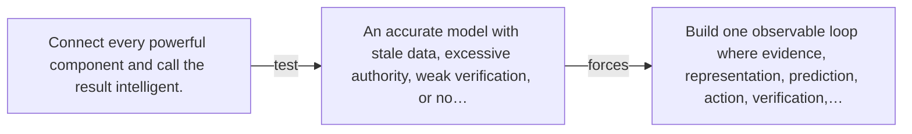

# Diagram — Excavation 100 — The Complete AI System — From Observation to Responsible Action

The picture carries this excavation's particular counterexample and repair.



```text
TRY     Connect every powerful component and call the result intelligent.
BREAK   An accurate model with stale data, excessive authority, weak verification, or no…
REPAIR  Build one observable loop where evidence, representation, prediction, action, verification,…
```

<!-- memory-film-v1:start -->
## Five-frame memory film

```text
QUESTION       What fails if we connect every powerful component and call the result intelligent?
     ↓
OBJECT         the complete ai system compass mounted on the map of branching journeys
     ↓
VISIBLE BREAK  The compass follows the tempting path—connect every powerful component and call the result intelligent. Then the evidence answers: an accurate model with stale data, excessive authority, weak verification, or no accountability still fails.
     ↓
TRANSFORMATION The expedition leader changes one moving part. The compass can now build one observable loop where evidence, representation, prediction, action, verification, feedback, and governance constrain one another.
     ↓
MEMORY SEAL    The Complete AI System keeps the missing power: build one observable loop where evidence, representation, prediction, action, verification, feedback, and governance constrain one another.
```
<!-- memory-film-v1:end -->
