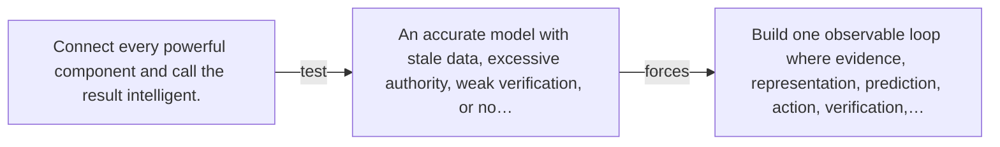

# Diagram — Excavation 100 — The Complete AI System — From Observation to Responsible Action

The picture carries this excavation's particular counterexample and repair.



```text
TRY     Connect every powerful component and call the result intelligent.
BREAK   An accurate model with stale data, excessive authority, weak verification, or no…
REPAIR  Build one observable loop where evidence, representation, prediction, action, verification,…
```
