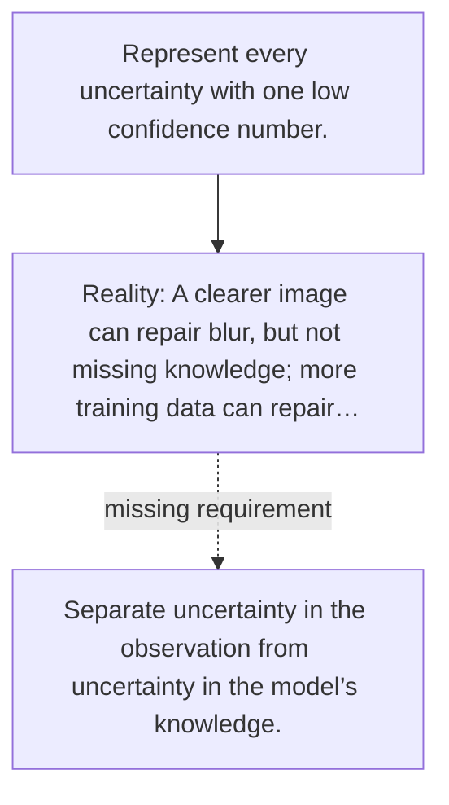

# Diagram — Excavation 101 — Two Kinds of Uncertainty

The picture carries this excavation's particular counterexample and repair.



```text
TRY     Represent every uncertainty with one low confidence number.
BREAK   A clearer image can repair blur, but not missing knowledge; more training data can repair…
REPAIR  Separate uncertainty in the observation from uncertainty in the model’s knowledge.
```

<!-- memory-film-v1:start -->
## Five-frame memory film

```text
QUESTION       What fails if we represent every uncertainty with one low confidence number?
     ↓
OBJECT         the two kinds of uncertainty bridge mounted on the table of mirrored maps
     ↓
VISIBLE BREAK  The bridge follows the tempting path—represent every uncertainty with one low confidence number. Then the evidence answers: a clearer image can repair blur, but not missing knowledge; more training data can repair missing knowledge, but not a genuinely coin-flip outcome.
     ↓
TRANSFORMATION The keeper of unfinished questions changes one moving part. The bridge can now separate uncertainty in the observation from uncertainty in the model’s knowledge.
     ↓
MEMORY SEAL    Two Kinds of Uncertainty keeps the missing power: separate uncertainty in the observation from uncertainty in the model’s knowledge.
```
<!-- memory-film-v1:end -->
