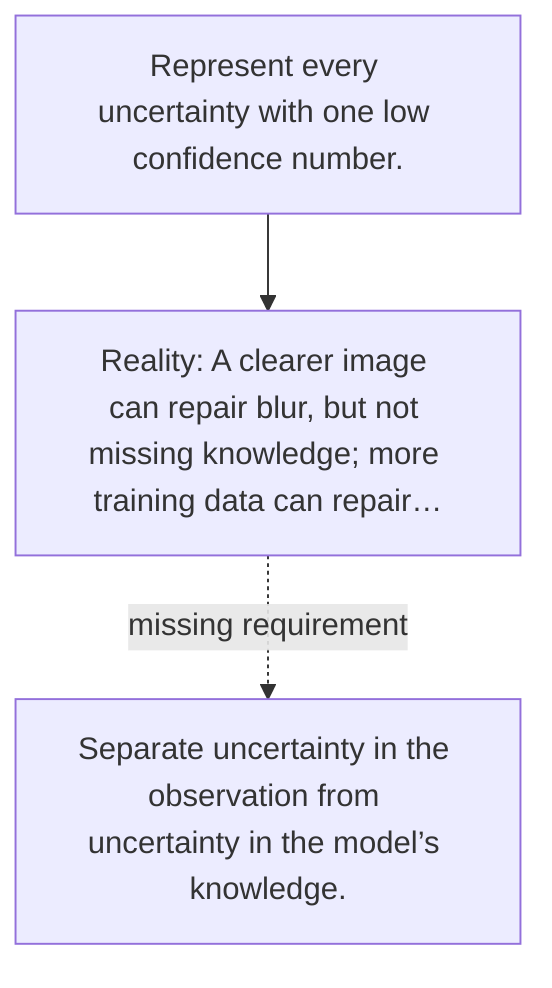

# Diagram — Excavation 101 — Two Kinds of Uncertainty

The picture carries this excavation's particular counterexample and repair.



```text
TRY     Represent every uncertainty with one low confidence number.
BREAK   A clearer image can repair blur, but not missing knowledge; more training data can repair…
REPAIR  Separate uncertainty in the observation from uncertainty in the model’s knowledge.
```
