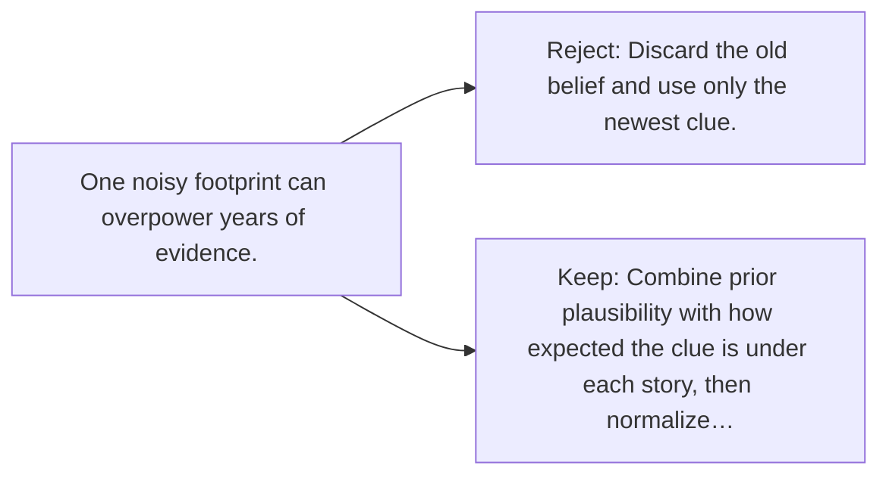

# Diagram — Excavation 102 — Bayesian Updating

The picture carries this excavation's particular counterexample and repair.



```text
TRY     Discard the old belief and use only the newest clue.
BREAK   One noisy footprint can overpower years of evidence.
REPAIR  Combine prior plausibility with how expected the clue is under each story, then normalize…
```
