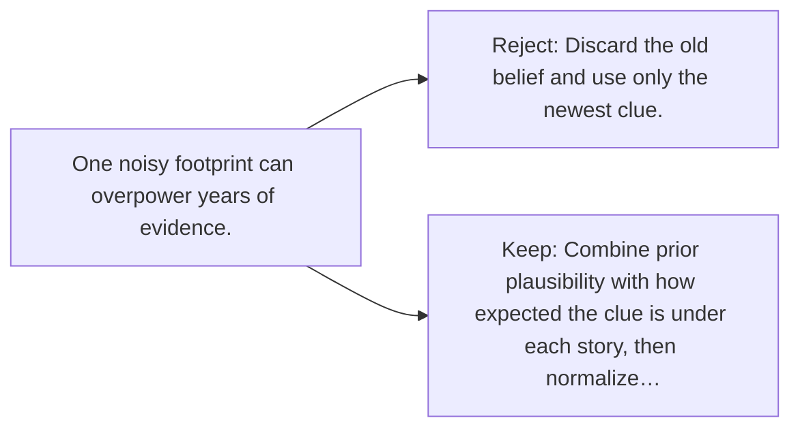

# Diagram — Excavation 102 — Bayesian Updating

The picture carries this excavation's particular counterexample and repair.



```text
TRY     Discard the old belief and use only the newest clue.
BREAK   One noisy footprint can overpower years of evidence.
REPAIR  Combine prior plausibility with how expected the clue is under each story, then normalize…
```

<!-- memory-film-v1:start -->
## Five-frame memory film

```text
QUESTION       What fails if we discard the old belief and use only the newest clue?
     ↓
OBJECT         the bayesian updating thread mounted on the table of mirrored maps
     ↓
VISIBLE BREAK  The thread follows the tempting path—discard the old belief and use only the newest clue. Then the evidence answers: the trouble appears immediately: one noisy footprint can overpower years of evidence.
     ↓
TRANSFORMATION The keeper of unfinished questions changes one moving part. The thread can now combine prior plausibility with how expected the clue is under each story, then normalize across stories.
     ↓
MEMORY SEAL    Bayesian Updating keeps the missing power: combine prior plausibility with how expected the clue is under each story, then normalize across stories.
```
<!-- memory-film-v1:end -->
