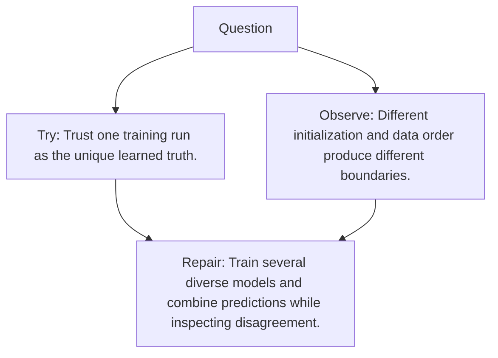

# Diagram — Excavation 103 — Ensembles

The picture carries this excavation's particular counterexample and repair.



```text
TRY     Trust one training run as the unique learned truth.
BREAK   Different initialization and data order produce different boundaries.
REPAIR  Train several diverse models and combine predictions while inspecting disagreement.
```
