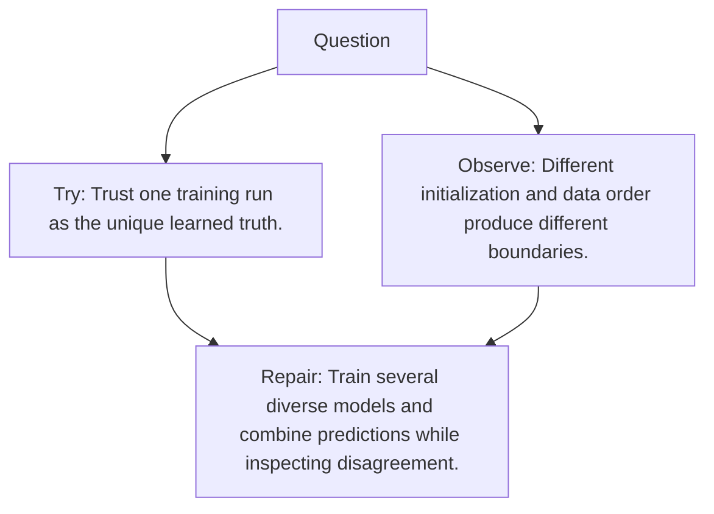

# Diagram — Excavation 103 — Ensembles

The picture carries this excavation's particular counterexample and repair.



```text
TRY     Trust one training run as the unique learned truth.
BREAK   Different initialization and data order produce different boundaries.
REPAIR  Train several diverse models and combine predictions while inspecting disagreement.
```

<!-- memory-film-v1:start -->
## Five-frame memory film

```text
QUESTION       What fails if we trust one training run as the unique learned truth?
     ↓
OBJECT         the ensembles mirror mounted on the table of mirrored maps
     ↓
VISIBLE BREAK  The mirror follows the tempting path—trust one training run as the unique learned truth. Then the evidence answers: different initialization and data order produce different boundaries.
     ↓
TRANSFORMATION The keeper of unfinished questions changes one moving part. The mirror can now train several diverse models and combine predictions while inspecting disagreement.
     ↓
MEMORY SEAL    Ensembles keeps the missing power: train several diverse models and combine predictions while inspecting disagreement.
```
<!-- memory-film-v1:end -->
