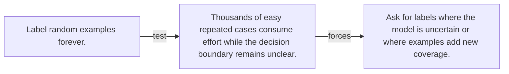

# Diagram — Excavation 104 — Active Learning

The picture carries this excavation's particular counterexample and repair.



```text
TRY     Label random examples forever.
BREAK   Thousands of easy repeated cases consume effort while the decision boundary remains unclear.
REPAIR  Ask for labels where the model is uncertain or where examples add new coverage.
```
