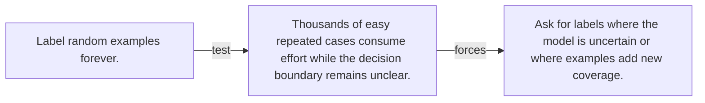

# Diagram — Excavation 104 — Active Learning

The picture carries this excavation's particular counterexample and repair.



```text
TRY     Label random examples forever.
BREAK   Thousands of easy repeated cases consume effort while the decision boundary remains unclear.
REPAIR  Ask for labels where the model is uncertain or where examples add new coverage.
```

<!-- memory-film-v1:start -->
## Five-frame memory film

```text
QUESTION       What fails if we label random examples forever?
     ↓
OBJECT         the active learning bell mounted on the table of mirrored maps
     ↓
VISIBLE BREAK  The bell follows the tempting path—label random examples forever. Then the evidence answers: thousands of easy repeated cases consume effort while the decision boundary remains unclear.
     ↓
TRANSFORMATION The keeper of unfinished questions changes one moving part. The bell can now ask for labels where the model is uncertain or where examples add new coverage.
     ↓
MEMORY SEAL    Active Learning keeps the missing power: ask for labels where the model is uncertain or where examples add new coverage.
```
<!-- memory-film-v1:end -->
