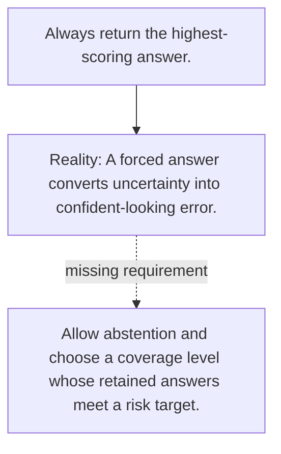

# Diagram — Excavation 105 — Selective Prediction

The picture carries this excavation's particular counterexample and repair.



```text
TRY     Always return the highest-scoring answer.
BREAK   A forced answer converts uncertainty into confident-looking error.
REPAIR  Allow abstention and choose a coverage level whose retained answers meet a risk target.
```

<!-- memory-film-v1:start -->
## Five-frame memory film

```text
QUESTION       What fails if we always return the highest-scoring answer?
     ↓
OBJECT         the selective prediction vessel mounted on the table of mirrored maps
     ↓
VISIBLE BREAK  The vessel follows the tempting path—always return the highest-scoring answer. Then the evidence answers: a forced answer converts uncertainty into confident-looking error.
     ↓
TRANSFORMATION The keeper of unfinished questions changes one moving part. The vessel can now allow abstention and choose a coverage level whose retained answers meet a risk target.
     ↓
MEMORY SEAL    Selective Prediction keeps the missing power: allow abstention and choose a coverage level whose retained answers meet a risk target.
```
<!-- memory-film-v1:end -->
