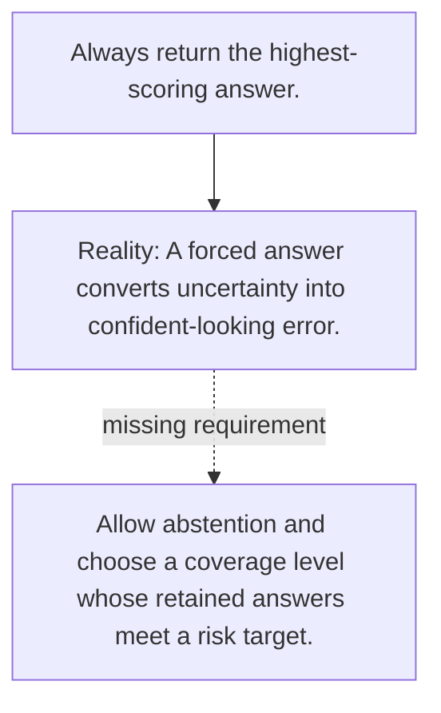

# Diagram — Excavation 105 — Selective Prediction

The picture carries this excavation's particular counterexample and repair.



```text
TRY     Always return the highest-scoring answer.
BREAK   A forced answer converts uncertainty into confident-looking error.
REPAIR  Allow abstention and choose a coverage level whose retained answers meet a risk target.
```
