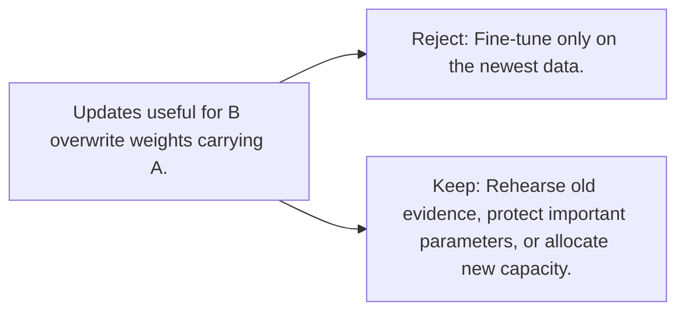

# Diagram — Excavation 106 — Catastrophic Forgetting

The picture carries this excavation's particular counterexample and repair.



```text
TRY     Fine-tune only on the newest data.
BREAK   Updates useful for B overwrite weights carrying A.
REPAIR  Rehearse old evidence, protect important parameters, or allocate new capacity.
```

<!-- memory-film-v1:start -->
## Five-frame memory film

```text
QUESTION       What fails if we fine-tune only on the newest data?
     ↓
OBJECT         the catastrophic forgetting gate mounted on the table of mirrored maps
     ↓
VISIBLE BREAK  The gate follows the tempting path—fine-tune only on the newest data. Then the evidence answers: updates useful for B overwrite weights carrying A.
     ↓
TRANSFORMATION The keeper of unfinished questions changes one moving part. The gate can now rehearse old evidence, protect important parameters, or allocate new capacity.
     ↓
MEMORY SEAL    Catastrophic Forgetting keeps the missing power: rehearse old evidence, protect important parameters, or allocate new capacity.
```
<!-- memory-film-v1:end -->
