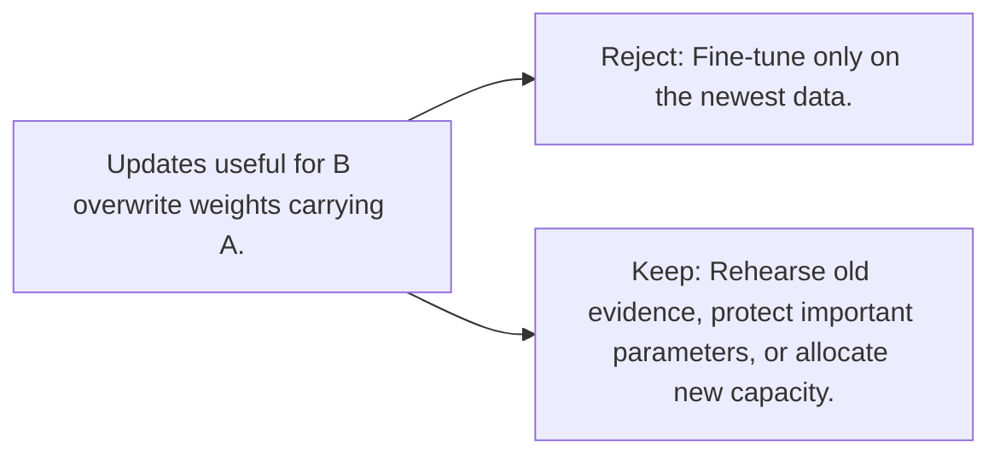

# Diagram — Excavation 106 — Catastrophic Forgetting

The picture carries this excavation's particular counterexample and repair.



```text
TRY     Fine-tune only on the newest data.
BREAK   Updates useful for B overwrite weights carrying A.
REPAIR  Rehearse old evidence, protect important parameters, or allocate new capacity.
```
