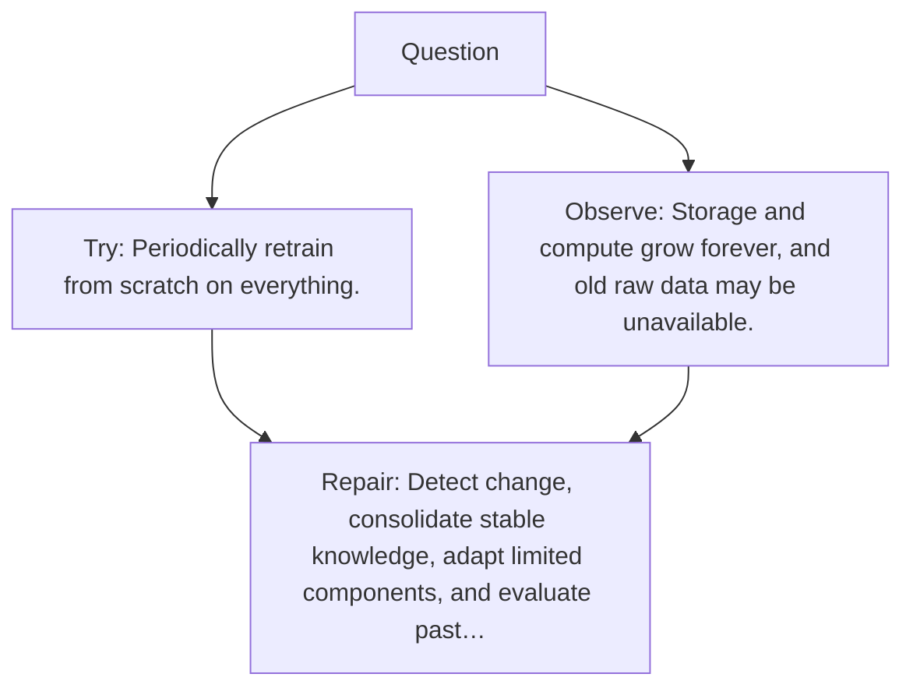

# Diagram — Excavation 107 — Continual Learning

The picture carries this excavation's particular counterexample and repair.



```text
TRY     Periodically retrain from scratch on everything.
BREAK   Storage and compute grow forever, and old raw data may be unavailable.
REPAIR  Detect change, consolidate stable knowledge, adapt limited components, and evaluate past…
```

<!-- memory-film-v1:start -->
## Five-frame memory film

```text
QUESTION       What fails if we periodically retrain from scratch on everything?
     ↓
OBJECT         the continual learning wheel mounted on the table of mirrored maps
     ↓
VISIBLE BREAK  The wheel follows the tempting path—periodically retrain from scratch on everything. Then the evidence answers: the trouble appears immediately: storage and compute grow forever, and old raw data may be unavailable.
     ↓
TRANSFORMATION The keeper of unfinished questions changes one moving part. The wheel can now detect change, consolidate stable knowledge, adapt limited components, and evaluate past and present tasks together.
     ↓
MEMORY SEAL    Continual Learning keeps the missing power: detect change, consolidate stable knowledge, adapt limited components, and evaluate past and present tasks together.
```
<!-- memory-film-v1:end -->
