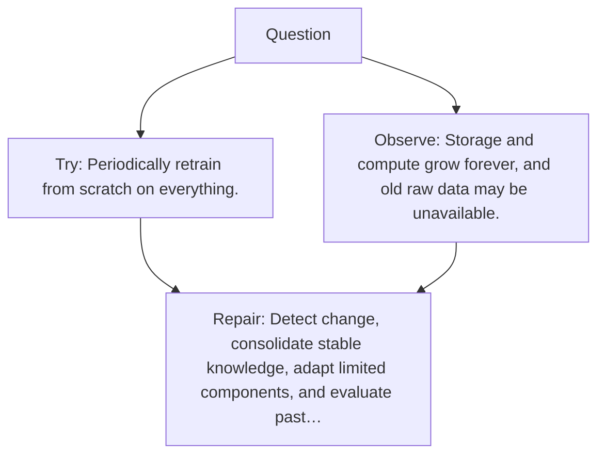

# Diagram — Excavation 107 — Continual Learning

The picture carries this excavation's particular counterexample and repair.



```text
TRY     Periodically retrain from scratch on everything.
BREAK   Storage and compute grow forever, and old raw data may be unavailable.
REPAIR  Detect change, consolidate stable knowledge, adapt limited components, and evaluate past…
```
