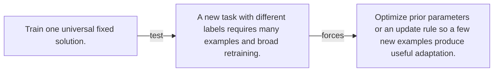

# Diagram — Excavation 108 — Meta-Learning

The picture carries this excavation's particular counterexample and repair.



```text
TRY     Train one universal fixed solution.
BREAK   A new task with different labels requires many examples and broad retraining.
REPAIR  Optimize prior parameters or an update rule so a few new examples produce useful adaptation.
```
