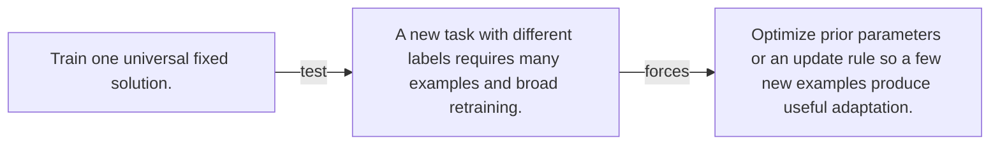

# Diagram — Excavation 108 — Meta-Learning

The picture carries this excavation's particular counterexample and repair.



```text
TRY     Train one universal fixed solution.
BREAK   A new task with different labels requires many examples and broad retraining.
REPAIR  Optimize prior parameters or an update rule so a few new examples produce useful adaptation.
```

<!-- memory-film-v1:start -->
## Five-frame memory film

```text
QUESTION       What fails if we train one universal fixed solution?
     ↓
OBJECT         the meta-learning map mounted on the table of mirrored maps
     ↓
VISIBLE BREAK  The map follows the tempting path—train one universal fixed solution. Then the evidence answers: a new task with different labels requires many examples and broad retraining.
     ↓
TRANSFORMATION The keeper of unfinished questions changes one moving part. The map can now optimize prior parameters or an update rule so a few new examples produce useful adaptation.
     ↓
MEMORY SEAL    Meta-Learning keeps the missing power: optimize prior parameters or an update rule so a few new examples produce useful adaptation.
```
<!-- memory-film-v1:end -->
