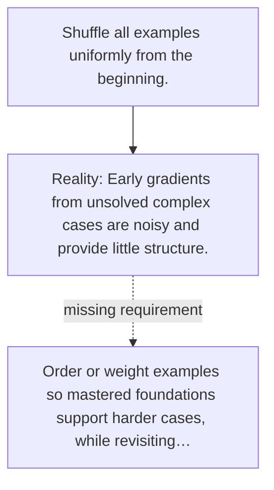

# Diagram — Excavation 109 — Curriculum Learning

The picture carries this excavation's particular counterexample and repair.



```text
TRY     Shuffle all examples uniformly from the beginning.
BREAK   Early gradients from unsolved complex cases are noisy and provide little structure.
REPAIR  Order or weight examples so mastered foundations support harder cases, while revisiting…
```
