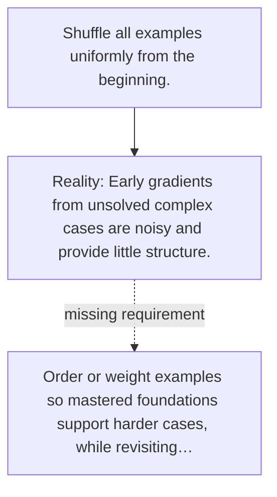

# Diagram — Excavation 109 — Curriculum Learning

The picture carries this excavation's particular counterexample and repair.



```text
TRY     Shuffle all examples uniformly from the beginning.
BREAK   Early gradients from unsolved complex cases are noisy and provide little structure.
REPAIR  Order or weight examples so mastered foundations support harder cases, while revisiting…
```

<!-- memory-film-v1:start -->
## Five-frame memory film

```text
QUESTION       What fails if we shuffle all examples uniformly from the beginning?
     ↓
OBJECT         the curriculum learning scale mounted on the table of mirrored maps
     ↓
VISIBLE BREAK  The scale follows the tempting path—shuffle all examples uniformly from the beginning. Then the evidence answers: early gradients from unsolved complex cases are noisy and provide little structure.
     ↓
TRANSFORMATION The keeper of unfinished questions changes one moving part. The scale can now order or weight examples so mastered foundations support harder cases, while revisiting earlier skills.
     ↓
MEMORY SEAL    Curriculum Learning keeps the missing power: order or weight examples so mastered foundations support harder cases, while revisiting earlier skills.
```
<!-- memory-film-v1:end -->
