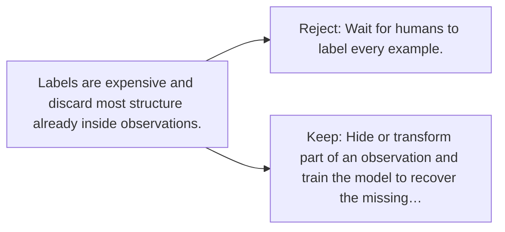

# Diagram — Excavation 110 — Self-Supervised Learning

The picture carries this excavation's particular counterexample and repair.



```text
TRY     Wait for humans to label every example.
BREAK   Labels are expensive and discard most structure already inside observations.
REPAIR  Hide or transform part of an observation and train the model to recover the missing…
```

<!-- memory-film-v1:start -->
## Five-frame memory film

```text
QUESTION       What fails if we wait for humans to label every example?
     ↓
OBJECT         the self-supervised learning gear mounted on the table of mirrored maps
     ↓
VISIBLE BREAK  The gear follows the tempting path—wait for humans to label every example. Then the evidence answers: labels are expensive and discard most structure already inside observations.
     ↓
TRANSFORMATION The keeper of unfinished questions changes one moving part. The gear can now hide or transform part of an observation and train the model to recover the missing relation.
     ↓
MEMORY SEAL    Self-Supervised Learning keeps the missing power: hide or transform part of an observation and train the model to recover the missing relation.
```
<!-- memory-film-v1:end -->
