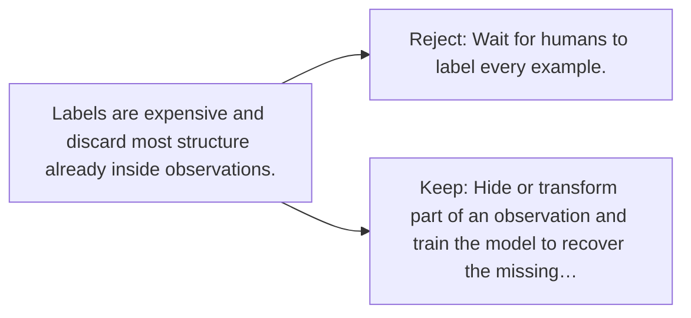

# Diagram — Excavation 110 — Self-Supervised Learning

The picture carries this excavation's particular counterexample and repair.



```text
TRY     Wait for humans to label every example.
BREAK   Labels are expensive and discard most structure already inside observations.
REPAIR  Hide or transform part of an observation and train the model to recover the missing…
```
