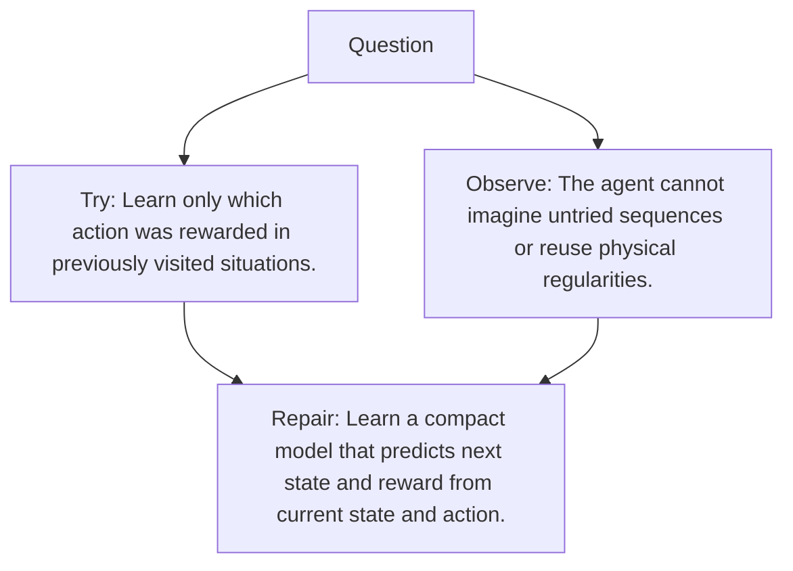

# Diagram — Excavation 111 — World Models

The picture carries this excavation's particular counterexample and repair.



```text
TRY     Learn only which action was rewarded in previously visited situations.
BREAK   The agent cannot imagine untried sequences or reuse physical regularities.
REPAIR  Learn a compact model that predicts next state and reward from current state and action.
```
