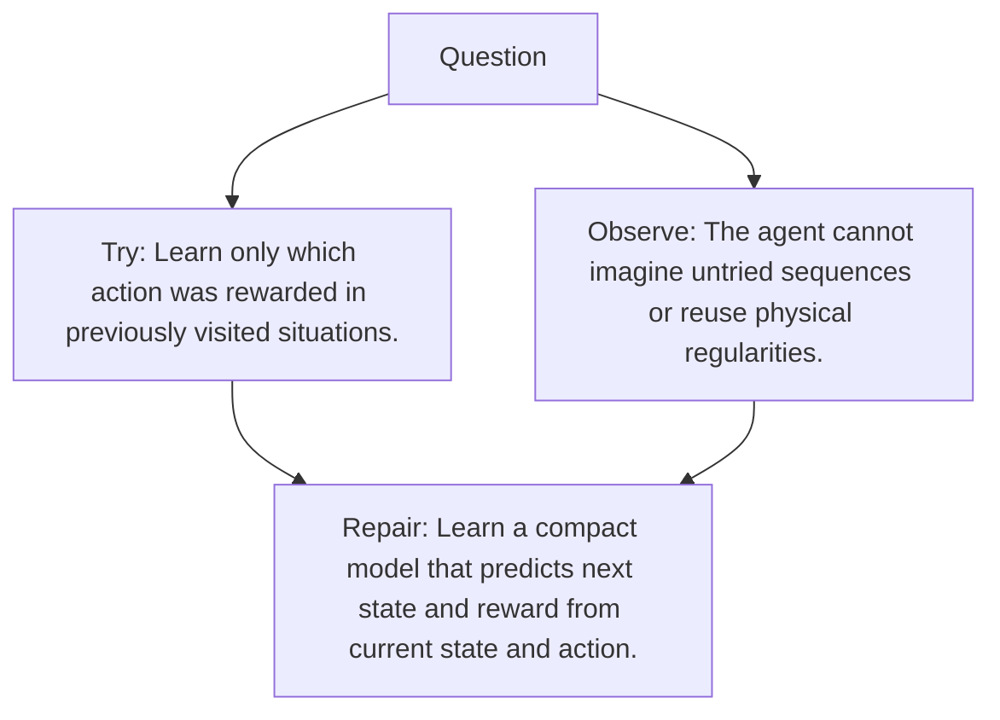

# Diagram — Excavation 111 — World Models

The picture carries this excavation's particular counterexample and repair.



```text
TRY     Learn only which action was rewarded in previously visited situations.
BREAK   The agent cannot imagine untried sequences or reuse physical regularities.
REPAIR  Learn a compact model that predicts next state and reward from current state and action.
```

<!-- memory-film-v1:start -->
## Five-frame memory film

```text
QUESTION       What fails if we learn only which action was rewarded in previously visited situations?
     ↓
OBJECT         the world models prism mounted on the table of mirrored maps
     ↓
VISIBLE BREAK  The prism follows the tempting path—learn only which action was rewarded in previously visited situations. Then the evidence answers: the agent cannot imagine untried sequences or reuse physical regularities.
     ↓
TRANSFORMATION The keeper of unfinished questions changes one moving part. The prism can now learn a compact model that predicts next state and reward from current state and action.
     ↓
MEMORY SEAL    World Models keeps the missing power: learn a compact model that predicts next state and reward from current state and action.
```
<!-- memory-film-v1:end -->
