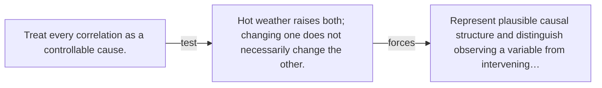

# Diagram — Excavation 112 — Causal Inference

The picture carries this excavation's particular counterexample and repair.



```text
TRY     Treat every correlation as a controllable cause.
BREAK   Hot weather raises both; changing one does not necessarily change the other.
REPAIR  Represent plausible causal structure and distinguish observing a variable from intervening…
```
