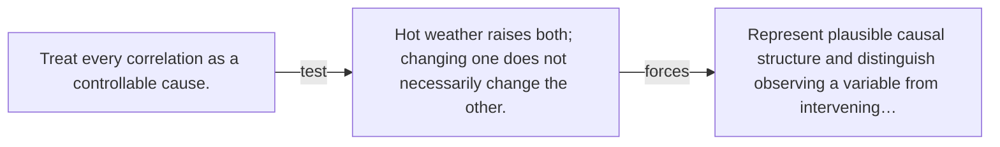

# Diagram — Excavation 112 — Causal Inference

The picture carries this excavation's particular counterexample and repair.



```text
TRY     Treat every correlation as a controllable cause.
BREAK   Hot weather raises both; changing one does not necessarily change the other.
REPAIR  Represent plausible causal structure and distinguish observing a variable from intervening…
```

<!-- memory-film-v1:start -->
## Five-frame memory film

```text
QUESTION       What fails if we treat every correlation as a controllable cause?
     ↓
OBJECT         the causal inference seal mounted on the table of mirrored maps
     ↓
VISIBLE BREAK  The seal follows the tempting path—treat every correlation as a controllable cause. Then the evidence answers: the trouble appears immediately: hot weather raises both; changing one does not necessarily change the other.
     ↓
TRANSFORMATION The keeper of unfinished questions changes one moving part. The seal can now represent plausible causal structure and distinguish observing a variable from intervening on it.
     ↓
MEMORY SEAL    Causal Inference keeps the missing power: represent plausible causal structure and distinguish observing a variable from intervening on it.
```
<!-- memory-film-v1:end -->
