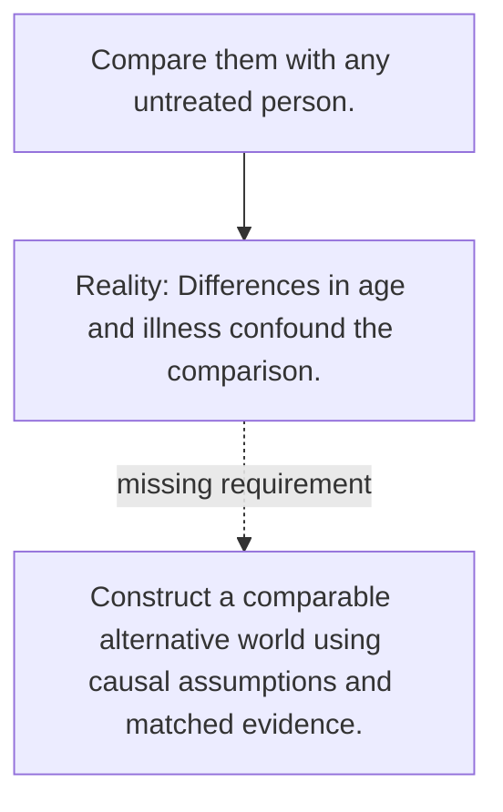

# Diagram — Excavation 113 — Counterfactuals

The picture carries this excavation's particular counterexample and repair.



```text
TRY     Compare them with any untreated person.
BREAK   Differences in age and illness confound the comparison.
REPAIR  Construct a comparable alternative world using causal assumptions and matched evidence.
```

<!-- memory-film-v1:start -->
## Five-frame memory film

```text
QUESTION       What fails if we compare them with any untreated person?
     ↓
OBJECT         the counterfactuals lens mounted on the table of mirrored maps
     ↓
VISIBLE BREAK  The lens follows the tempting path—compare them with any untreated person. Then the evidence answers: differences in age and illness confound the comparison.
     ↓
TRANSFORMATION The keeper of unfinished questions changes one moving part. The lens can now construct a comparable alternative world using causal assumptions and matched evidence.
     ↓
MEMORY SEAL    Counterfactuals keeps the missing power: construct a comparable alternative world using causal assumptions and matched evidence.
```
<!-- memory-film-v1:end -->
