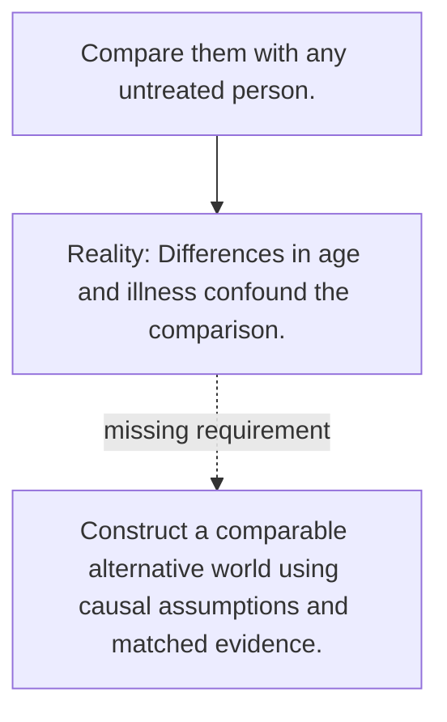

# Diagram — Excavation 113 — Counterfactuals

The picture carries this excavation's particular counterexample and repair.



```text
TRY     Compare them with any untreated person.
BREAK   Differences in age and illness confound the comparison.
REPAIR  Construct a comparable alternative world using causal assumptions and matched evidence.
```
