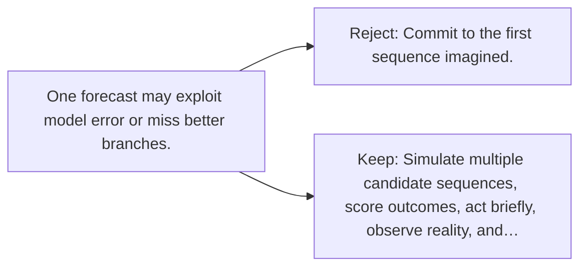

# Diagram — Excavation 114 — Model-Based Planning

The picture carries this excavation's particular counterexample and repair.



```text
TRY     Commit to the first sequence imagined.
BREAK   One forecast may exploit model error or miss better branches.
REPAIR  Simulate multiple candidate sequences, score outcomes, act briefly, observe reality, and…
```
