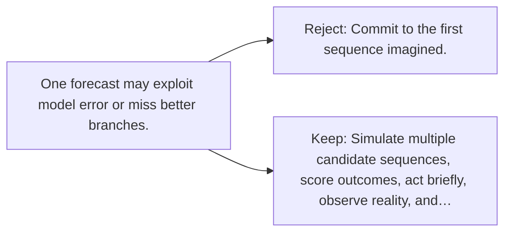

# Diagram — Excavation 114 — Model-Based Planning

The picture carries this excavation's particular counterexample and repair.



```text
TRY     Commit to the first sequence imagined.
BREAK   One forecast may exploit model error or miss better branches.
REPAIR  Simulate multiple candidate sequences, score outcomes, act briefly, observe reality, and…
```

<!-- memory-film-v1:start -->
## Five-frame memory film

```text
QUESTION       What fails if we commit to the first sequence imagined?
     ↓
OBJECT         the model-based planning key mounted on the table of mirrored maps
     ↓
VISIBLE BREAK  The key follows the tempting path—commit to the first sequence imagined. Then the evidence answers: one forecast may exploit model error or miss better branches.
     ↓
TRANSFORMATION The keeper of unfinished questions changes one moving part. The key can now simulate multiple candidate sequences, score outcomes, act briefly, observe reality, and plan again.
     ↓
MEMORY SEAL    Model-Based Planning keeps the missing power: simulate multiple candidate sequences, score outcomes, act briefly, observe reality, and plan again.
```
<!-- memory-film-v1:end -->
