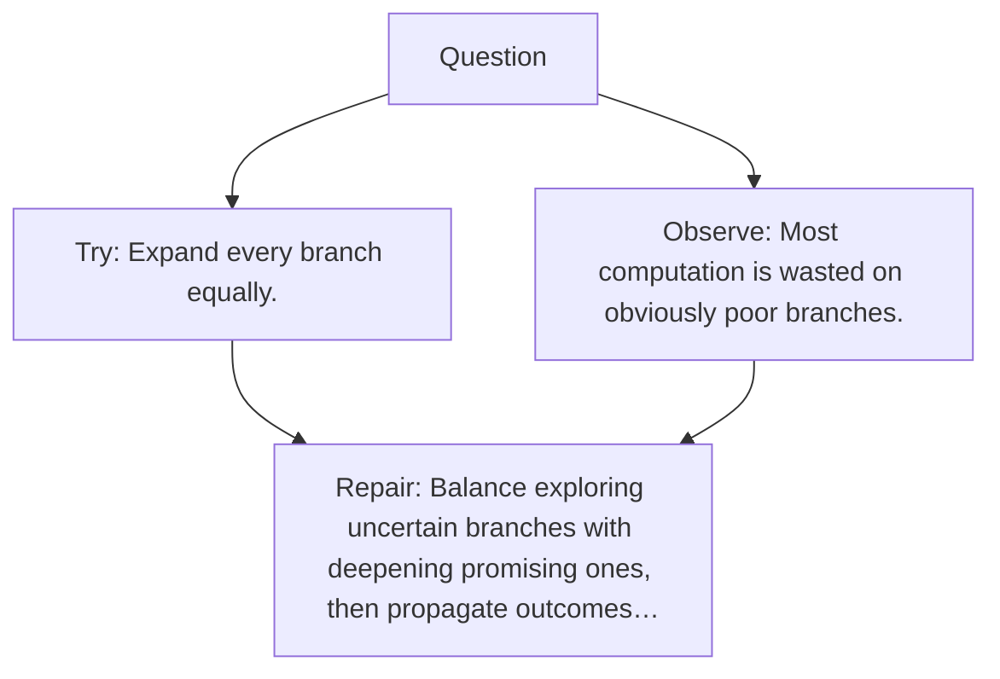

# Diagram — Excavation 115 — Tree Search

The picture carries this excavation's particular counterexample and repair.



```text
TRY     Expand every branch equally.
BREAK   Most computation is wasted on obviously poor branches.
REPAIR  Balance exploring uncertain branches with deepening promising ones, then propagate outcomes…
```

<!-- memory-film-v1:start -->
## Five-frame memory film

```text
QUESTION       What fails if we expand every branch equally?
     ↓
OBJECT         the tree search lantern mounted on the table of mirrored maps
     ↓
VISIBLE BREAK  The lantern follows the tempting path—expand every branch equally. Then the evidence answers: most computation is wasted on obviously poor branches.
     ↓
TRANSFORMATION The keeper of unfinished questions changes one moving part. The lantern can now balance exploring uncertain branches with deepening promising ones, then propagate outcomes backward.
     ↓
MEMORY SEAL    Tree Search keeps the missing power: balance exploring uncertain branches with deepening promising ones, then propagate outcomes backward.
```
<!-- memory-film-v1:end -->
