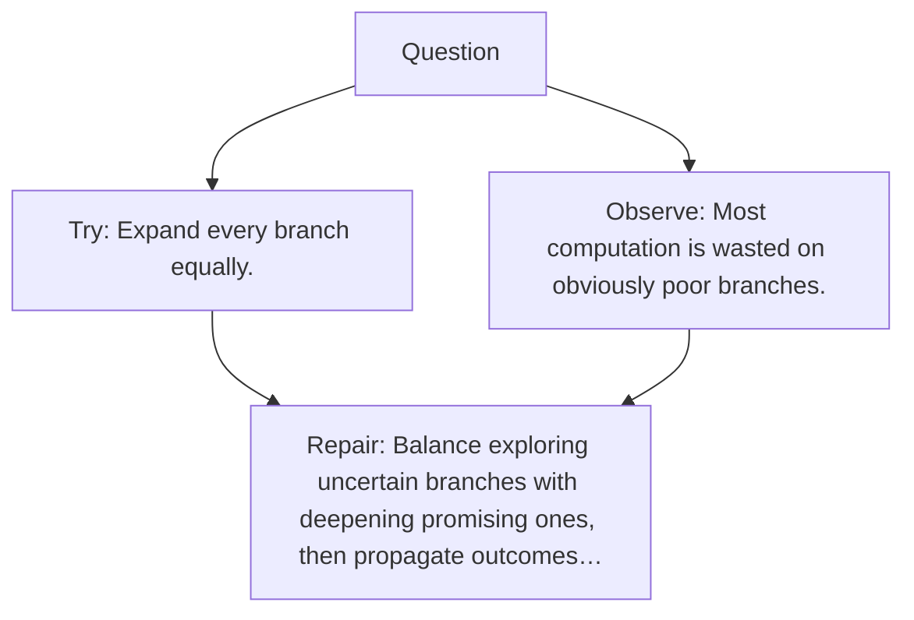

# Diagram — Excavation 115 — Tree Search

The picture carries this excavation's particular counterexample and repair.



```text
TRY     Expand every branch equally.
BREAK   Most computation is wasted on obviously poor branches.
REPAIR  Balance exploring uncertain branches with deepening promising ones, then propagate outcomes…
```
