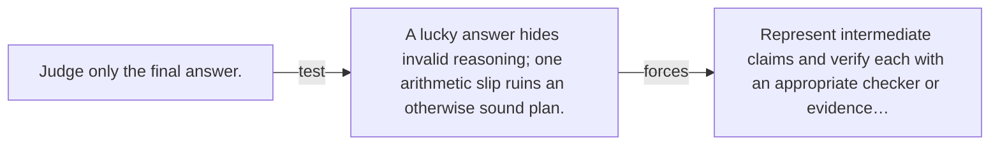

# Diagram — Excavation 116 — Reasoning and Verification

The picture carries this excavation's particular counterexample and repair.



```text
TRY     Judge only the final answer.
BREAK   A lucky answer hides invalid reasoning; one arithmetic slip ruins an otherwise sound plan.
REPAIR  Represent intermediate claims and verify each with an appropriate checker or evidence…
```
