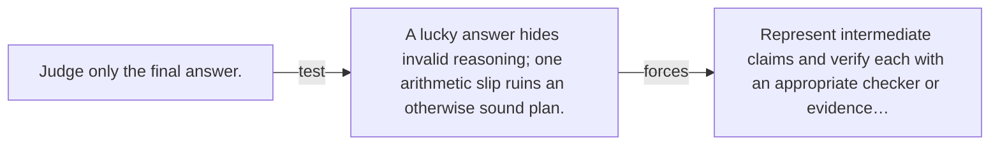

# Diagram — Excavation 116 — Reasoning and Verification

The picture carries this excavation's particular counterexample and repair.



```text
TRY     Judge only the final answer.
BREAK   A lucky answer hides invalid reasoning; one arithmetic slip ruins an otherwise sound plan.
REPAIR  Represent intermediate claims and verify each with an appropriate checker or evidence…
```

<!-- memory-film-v1:start -->
## Five-frame memory film

```text
QUESTION       What fails if we judge only the final answer?
     ↓
OBJECT         the reasoning and verification compass mounted on the table of mirrored maps
     ↓
VISIBLE BREAK  The compass follows the tempting path—judge only the final answer. Then the evidence answers: a lucky answer hides invalid reasoning; one arithmetic slip ruins an otherwise sound plan.
     ↓
TRANSFORMATION The keeper of unfinished questions changes one moving part. The compass can now represent intermediate claims and verify each with an appropriate checker or evidence source.
     ↓
MEMORY SEAL    Reasoning and Verification keeps the missing power: represent intermediate claims and verify each with an appropriate checker or evidence source.
```
<!-- memory-film-v1:end -->
